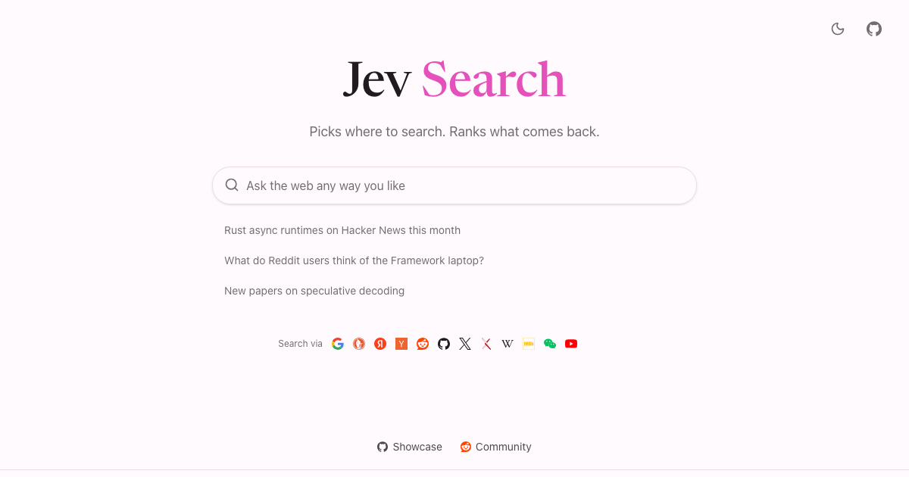

# Jev Search

[](https://jev.s1.dev)

Search the web in plain language. Jev Search chooses sources, time ranges and search terms, then ranks the results returned through [Search1API](https://www.search1api.com). You get links and snippets, with visible relevance judgments and editable filters. No generated answers.

This fork adapts the upstream web app ([superagents-lab/jev-search](https://github.com/superagents-lab/jev-search), hosted at [jev.s1.dev](https://jev.s1.dev)) to run as a Nimi desktop App. The adaptation starts from upstream `main` at `67027d0`; later upstream changes are not included. Jev Search is built by Search1API; it is an independent project, not an official TypeSafe product.

## Nimi desktop adaptation

- **Runtime.** A client-only Vite single-page app with TanStack Router (file routes, the same routes and search parameters, kept in the URL hash) replaces TanStack Start on a Cloudflare Worker. It runs in an Electron Host (`src-electron/`) that Nimi Desktop supervises; the search pipeline runs in that Host (Node) through `host/search-host.ts`. There is no server route, SSR, KV, rate limiter, Wrangler configuration, service worker, web manifest or analytics beacon.
- **AI judgments use Nimi.** Reading the request (time window, sources, search terms) and judging each result's relevance go through one injected function that calls Nimi's `text.decide` capability. Which model answers, and whether it runs locally or in the cloud, is decided and configured in Nimi; the app never knows or branches on backend, provider or model. The TypeSafe, Vercel and Cloudflare provider chain, its environment variables and its fallbacks are gone.
- **Search1API stays app-owned.** Its key is entered once in the app's settings (the key button at the top right) and handed to the host. The host seals it with the operating system's encryption (Electron `safeStorage`) and keeps only that ciphertext, base64 encoded, in the App's Nimi-mediated storage (`settings/search1api.json`); without OS encryption the key is refused rather than stored in the clear. The page only learns whether a key is configured; the key is never sent back, logged or put into results. Without a key every source reports "Search1API key is not configured".
- **Failures stay visible.** Each result is judged in its own decision. A judgment that fails, times out or is cancelled leaves that result unjudged with its reason and code, never 0%; unjudged results follow the judged on-topic ones and are not folded away as off topic. A failed engine shows a per-source notice while the results of the other engines stay. If the request itself cannot be interpreted, the search stops with the reason instead of guessing.
- **Stop and Search again.** Stop cancels a running search, keeps what has arrived and marks the search as stopped. Search again starts a new search with the same filters. Changing the request or a filter cancels the previous search, and its late events are ignored. A search whose page is closed, crashes or reloads is cancelled in the host.
- **Links leave the App.** Result and footer links open in the default browser; the App window never navigates away from its own page.

### Host contract

`createSearchHost({ decide, keyStore, cache?, now? })` has no Electron or Nimi imports. `decide` calls `services.ai.scenario.execute(spec, options)` and returns its `{ output: { type, answers }, traceId }` flattened to `{ type, answers, traceId }`, passing errors through; `reasonCode`, else `code`, else `name` is shown with each failure, and `OPERATION_ABORTED` and `OPERATION_TIMEOUT` count as cancelled and timed out. `keyStore` is the host's private `{ get(), set(key) }` storage. The shell adapter registers the handlers under the names in `src/lib/search-protocol.ts` and forwards task events to the page:

| Command | Payload | Result |
| --- | --- | --- |
| `ask` | `{ taskId, q, w?, s? }` | Resolves when the task has ended; its events stream on `search-event`. |
| `cancel` | `{ taskId }` | `{ canceled }`; the task ends with `stopped` at once. |
| `searchSettingsStatus` | none | `{ search1apiConfigured }` |
| `setSearch1ApiKey` | `{ apiKey }` | `{ search1apiConfigured }` |

Every event carries its `taskId`: `intent`, `found` and `lane` events, then exactly one of `done`, `error` or `stopped`. The host's `cancelAll()` stops every task when the page's session goes away.

The Electron Host (`src-electron/main.ts`) follows the Nimi App Tools reference Host: it binds Electron to the Nimi Host profile first, then loads Kit and registers `registerNimiElectronAppBridge` with these four commands as `appCommandHandlers` (`src-electron/search-commands.ts`, exact payload fields only) and `onSessionInvalidated` calling `cancelAll()`. `decide` is `services.ai.scenario.execute` (`src-electron/nimi-decide.ts`) and `keyStore` is the sealed store in `src-electron/search1api-key-store.ts`. Host refusals reach the page with a reason code: `SEARCH_COMMAND_PAYLOAD_INVALID`, `SEARCH_COMMAND_REJECTED`, `SEARCH1API_KEY_ENCRYPTION_UNAVAILABLE` or `SEARCH1API_KEY_UNREADABLE`.

The page is mounted with `mountJevSearch(container, { transport, history })` from `src/app.tsx`. `src/main.tsx` passes the transport of `src/lib/shell-transport.ts`, which implements `SearchTransport` (`src/lib/host-transport.ts`) with the Kit renderer bridge's `invoke` and `listenShell`, and a hash history for the page loaded from a file URL. Opened outside the Host, the page reports that the shell bridge is unavailable.

## How it works

1. **Understand.** One typed decision reads your request: how recent the results should be, whether it wants each source, and which search terms and name to use. You can override the source and time chips.
2. **Search.** Google, DuckDuckGo and Yandex search the open web. Hacker News, Reddit and GitHub each combine a Google site-restricted search with their dedicated engine (Hacker News uses the news endpoint). X, arXiv, YouTube, Wikipedia, IMDb and WeChat use vertical engines. Calls run concurrently; one failed engine does not discard another engine's results.
3. **Rank.** Each result is judged for relevance in its own decision, four at a time per engine. Results are merged by URL, ordered by relevance, engine agreement and original rank, and shown as each engine finishes. Lower-scoring results are grouped separately. A failed source shows a warning rather than a zero-result count.

Try “Rust async runtimes on Hacker News this month”, “What do Reddit users think of the Framework laptop?”, or “New papers on speculative decoding”. These are plain-language requests, not hardcoded filters; the last one names no source or time and lets the app choose.

Each engine has a 15-second deadline, and the whole search, from reading the request to the last judgment, fits in a 30-second budget: every decision gets the time left in that budget as its timeout. Google may start speculatively while the request is being read. Successful, non-empty engine responses are cached in the host's memory for 10 minutes to 6 hours, depending on the time window.

The optional `s` source list is capped at the number of supported sources (currently 12 entries before filtering); longer lists are rejected before any search. Repeated valid sources are merged, preserving their first occurrence, so repeating a source cannot multiply search or ranking calls. Selecting all supported sources remains allowed.

## Development

Requires Node.js 24+ and pnpm 10.34.5. Development resolves the Nimi SDK, Kit (with its Windows native carrier) and App Tools from complete local package archives through the overrides in `pnpm-workspace.yaml`; `pnpm-lock.yaml` pins them. Replace those overrides with the published versions before a public release.

```bash
pnpm install --frozen-lockfile   # also installs the Electron binary (install-electron --no)
pnpm dev                         # Nimi Desktop supervises the Electron Host; needs a running Desktop
pnpm test
pnpm typecheck                   # renderer and Host
pnpm build                       # renderer bundle in dist/, then a full type check
pnpm build:electron              # Host bundle: dist-electron/main.js and preload.cjs
pnpm check                       # Nimi App lifecycle checks (nimi-app check)
pnpm app:build -- --target windows-x86_64   # production package in dist-electron-package/
```

`pnpm dev` asks Nimi Desktop to build the Host with `pnpm build:electron`, start the renderer with `pnpm dev:renderer` (Vite on `http://127.0.0.1:1531`, declared in `nimi.app.yaml`) and launch the Host. Desktop rebuilds and restarts the Host when files under `src-electron/` change; the Host also bundles `host/` and the pipeline in `src/lib/`, so restart `pnpm dev` after editing those. Starting Electron or the renderer yourself does not give the page Nimi access. `pnpm build:electron:production` rebuilds everything with the production marker (which rejects development renderer URLs) and packages `jev-search-shell.exe` with `@electron/packager`.

Tests replace Search1API, the decision function, Nimi storage, OS encryption and the Kit bridge with fakes and make no network calls. `src/routeTree.gen.ts` is generated by the router plugin during `pnpm dev:renderer` and `pnpm build`, and by `pnpm generate-routes`; it is not committed.

### Verification status (2026-09-24)

The local test suite (217 tests), type checks, renderer and Host builds, `nimi-app check`, managed-file sync check, and Windows x86-64 target build and production pack passed. Nimi Desktop supervised the development Electron Host and opened the page. In this environment, the settings status request and a search both returned `runtime-service-untrusted`; Desktop identifies that code as a Runtime service identity rejection. Saving a real Search1API key, receiving a Nimi decision and search results, and installing or launching the packed App remain **NOT-VERIFIED**. The local target build and pack do not establish a public Release or Registry admission.

## Project layout

| Path | Responsibility |
| --- | --- |
| `src-electron/main.ts`, `preload.cts` | Electron Host: Nimi Host profile, Kit App bridge, window and link handling |
| `src-electron/search-commands.ts` | The App commands registered with Kit, payload validation, task events to the page |
| `src-electron/nimi-decide.ts`, `search1api-key-store.ts` | `text.decide` through the Host's SDK client; the OS-sealed Search1API key in Nimi storage |
| `host/search-host.ts` | Host command handlers: search tasks, cancellation, budget, Search1API key custody |
| `src/lib/decide.ts` | Typed decisions through the injected `text.decide` function |
| `src/lib/pipeline.ts` | Concurrent search and relevance judgments as an event stream, within the budgets |
| `src/lib/search1api.ts` | Search provider client and engine deadlines |
| `src/lib/cache.ts` | Per-engine response cache |
| `src/lib/sources.ts` | Sources, engine mappings and time windows |
| `src/lib/candidates.ts` | Search-query candidates |
| `src/lib/rank.ts`, `merge.ts` | Ordering, grouping and URL deduplication |
| `src/lib/search-protocol.ts`, `host-transport.ts`, `shell-transport.ts` | Commands, task events and the page's transport to the host over the Kit bridge |
| `src/lib/ask-session.ts`, `use-ask.ts` | One search task at a time on the page, isolated by task id |
| `src/app.tsx`, `src/main.tsx` | Mounting the page; the entry wires the Kit bridge transport and hash history |
| `nimi.app.yaml`, `.nimi/config/build-profile.yaml` | Nimi App declaration and the `electron-pnpm` build profile |
| `scripts/` | Host bundling and production packaging |
| `test/` | Provider-independent regression tests |

See [CONTRIBUTING.md](CONTRIBUTING.md) for development guidelines and [SECURITY.md](SECURITY.md) for vulnerability reporting.

## Data and limitations

- Engine searches go from the desktop host to Search1API with the app's key; Search1API queries the selected engines.
- Decisions go to Nimi's `text.decide`: the request, and for relevance each result's source, title and snippet. Whether a local model or a cloud service answers is decided and configured in Nimi. Nimi keeps its own record of each decision, including that input, for a limited time under its job retention rules.
- The host keeps engine responses (query-derived keys and snippets) in memory for their time-to-live, up to 500 entries, until the app exits. The app does not record search text, inferred queries or result clicks.
- The only stored App data is the OS-sealed Search1API key in the App's Nimi storage, plus the colour-scheme choice in the page's local storage. A key sealed on one system or user account cannot be opened on another; enter it again there.
- The page loads a font from Google Fonts. Result links lead to third-party sites.
- Relevance percentages are model judgments, not verified accuracy. Search snippets may be incorrect, incomplete or stale. Date filtering and Newest sorting prefer Search1API's `published_date`, falling back to snippet dates when unavailable. Day-only dates are displayed as calendar dates and filtered with allowance for the unknown time of day; unknown dates can remain. Selecting and ranking existing results does not verify their claims.

## Support

If the App does not start or cannot reach Nimi, restart it from Nimi Desktop. A failed search or judgment shows its reason and code on the search page, and the search settings say why a key could not be saved. Report problems through this repository's issue tracker with the App version, the Nimi Desktop version and that code; leave out API keys and any search text you do not want to share. Follow [SECURITY.md](SECURITY.md) for vulnerabilities.

## License and attribution

Application code is [MIT licensed](LICENSE). TypeSafe and Jev names and brand assets belong to their respective owners and are not included in this project's MIT license.

The favicon and Apple Touch Icon come from the icon links on [typesafe.ai](https://typesafe.ai/): [favicon](https://framerusercontent.com/images/aNFzSFxM4fjICmnibw7npfZjcQ.png) and [Apple Touch Icon](https://framerusercontent.com/images/kcuF2BEp5XaVfkmFB634IPRKQH0.png). The larger icons in `public/` are resized from the Apple Touch Icon. Most source icons use [Simple Icons](https://simpleicons.org). Google uses the four-colour G; Yandex uses the official 2021 mark (white Я in a red circle). Interface icons use [Lucide](https://lucide.dev). For your own branding, replace the icons in `public/` and update `src/components/wordmark.tsx` and the page metadata in `index.html`.
